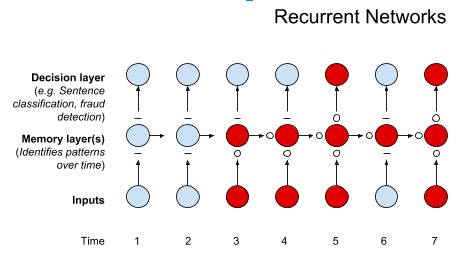
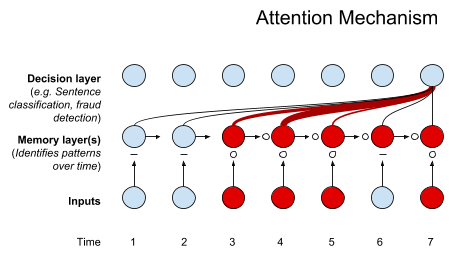
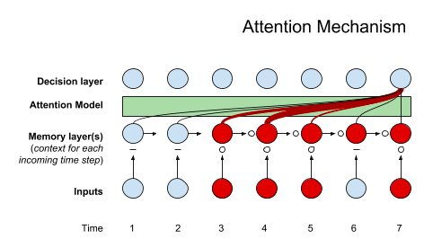
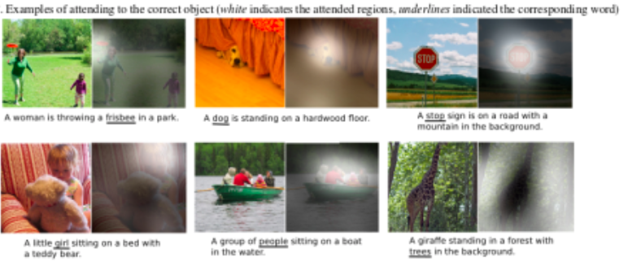

# A Beginner's Guide to Attention and Memory Networks

"Attention" is defined as the "active direction of the mind to an object", or more literarily as "giving heed".[1](#one) The word describes the mind's ability to allocate consideration unevenly across a field of sensation, thought and proprioception, to focus and bring certain inputs to the fore, while ignoring or diminishing the importance of others.  This is important, because the field of sensation is wide, and the mind's bandwidth to process information is narrow, and some inputs are indeed more important that others, with regard to any given goal. 

At any given moment, our minds concentrate on a subset of the total information available to them. (As we will show, this is also true for artificial neural networks using an attention mechanism.) For example, you are reading these words as a larger world flows around you: maybe you're in a room with traffic coursing outside, maybe you're in a plane and the pilot is making another annoying announcement about turbulence, but your focus is **HERE**. 

Attention is, in a sense, the mind's capital, the chief resource it can allocate and spend. Algorithms can also allocate attention, and they can learn how to do it better, by adjusting the weights they assign to various inputs. Attention is used for machine translation, speech recognition, reasoning, image captioning, summarization, and the visual identification of objects.

## Credit Assignment Among Available Features

The fundamental task of all neural networks is *credit assignment*. Credit assignment is allocating importance to input features through the weights of the neural network's model. Learning is the process by which neural networks figure out which input features correlate highly with the outcomes the net tries to predict, and their learnings are embodied in the adjusted quantities of the weights that result in accurate decisions about the data they're exposed to. 

But there are different ways to structure and channel the relationship of input features to outcomes. [Feed-forward networks](./neuralnet-overview.html) are a way of establishing a relationship between all input features (e.g. the pixels in a picture) and the predictions you want to make about the input (e.g. this photo represents a dog or a cat), and doing so all at the same time. 

When we try to predict temporal sequences of things, like words in a sentence or measurements in a time series (e.g. temperatures or stock prices), we channel inputs in other ways. For example, a [recurrent neural network like an LSTM](./lstm.html) is often used, since it takes account of information in the present time step as well as the context of past time steps. Below is one way to think about how a recurrent network operates: at each time step, it combines input from the present moment, as well as input from the memory layer, to make a decision about the data. 

RNNs cram everything they know about a sequence of data elements into the final hidden state of the network. An attention mechanism takes into account the input from several time steps, say, to make one prediction. It distributes attention over several hidden states. And just as importantly, it accords different weights, or degrees of importance, to those inputs, reflected below in the lines of different thicknesses and color. 

The original work on a basic attention mechanism represented a leap forward for machine translation. That advance, like many increases in accuracy, came at the cost of increased computational demands. With attention, you didn't have to fit the meaning of an entire English phrase into a single hidden state that you would translate to French. 

Another way to think about attention models is like this:

Let's say you are trying to generate a caption from an image. Each input could be part of an image fed into the attention model. The memory layer would feed in the words already generated, the context for future word predictions. The attention model would help the algorithm decide which parts of the image to focus on as it generated each new word (it would decide on the thickness of the lines), and those assignments of importance would be fed into a final decision layer that would generate a new word. 

Above, a model highlights which pixels it is focusing on as it predicts the underlined word in the respective captions. Below, a language model highlights the words from one language, French, that were relevant as it produced the English words in the translation. As you can see, attention provides us with a route to interpretability. We can render attention as a heat map over input data such as words and pixels, and thus communicate to human operators how a neural network made a decision. (This could be the basis of a feedback mechanism whereby those humans tell the network to pay attention to certain features and not others.) 

In autumn 2017, Google removed the attention mechanism from recurrent networks and showed that it could outperform RNNs alone, with an architecture called [Transformer](https://research.googleblog.com/2017/08/transformer-novel-neural-network.html).

## Memory Networks

You could say that attention networks are a kind of short-term memory that allocates attention over input features they have recently seen. Attention mechanisms are components of memory networks. 

Memory networks are a little different, but not too. They work with external data storage, and they are useful for, say, mapping questions as input to answers stored in that external memory. 

That external data storage takes the place of the hidden state in an RNN. The memory acts as an embedding that the attention mechanism can alter, writing to the memory what it learns, and reading from it. While the hidden states of a recurrent neural network are a sequence of embeddings, memory is an accumulation of those embeddings (imagine performing max pooling on all your hidden states -- that would be like memory). 

### <a name="beginner">Further Reading on Attention Networks</a>

* [Attention and Memory in Deep Learning and NLP](http://www.wildml.com/2016/01/attention-and-memory-in-deep-learning-and-nlp/)
* [Memory, attention, sequences](https://towardsdatascience.com/memory-attention-sequences-37456d271992)
* [Attention Mechanism](https://blog.heuritech.com/2016/01/20/attention-mechanism/)
* [Attention and Augmented Recurrent Neural Networks](https://distill.pub/2016/augmented-rnns/)
* [Attention in Neural Networks and How to Use It](http://akosiorek.github.io/ml/2017/10/14/visual-attention.html)
* [How Does Attention Work in Encoder-Decoder Recurrent Neural Networks](https://machinelearningmastery.com/how-does-attention-work-in-encoder-decoder-recurrent-neural-networks/)
* [Show, Attend and Tell: Neural Image Caption Generation with Visual Attention](https://arxiv.org/abs/1502.03044)
* [Recurrent Models of Visual Attention](https://arxiv.org/abs/1406.6247)
* [End-To-End Memory Networks](https://arxiv.org/abs/1503.08895)
* [Sequence to Sequence Learning with Neural Networks](https://arxiv.org/abs/1409.3215)
* [Learning Phrase Representations using RNN Encoder-Decoder for Statistical Machine Translation](https://arxiv.org/abs/1406.1078)
* [Neural Machine Translation by Jointly Learning to Align and Translate](https://arxiv.org/abs/1409.0473)
* [Effective Approaches to Attention-based Neural Machine Translation](https://arxiv.org/abs/1508.04025)
* [Attention Is All You Need](https://arxiv.org/abs/1706.03762)
* [Video Lecture 10: Neural Machine Translation and Models with Attention (Stanford)](https://www.youtube.com/watch?v=IxQtK2SjWWM)
* [Video Lecture 8 - Generating Language with Attention](https://www.youtube.com/watch?v=ah7_mfl7LD0)

### <a name="beginner">Other Machine Learning Tutorials</a>

* [Multilayer Perceptron (MLPs) for Classification](./multilayerperceptron.html)
* [Eigenvectors, Eigenvalues, Covariance, PCA and Entropy](./eigenvector.html)
* [LSTMs and Recurrent Networks](./lstm.html)
* [Word2vec, Doc2vec & GloVe: Neural Embeddings and NLP](./word2vec.html)
* [Introduction to Deep Neural Networks](./neuralnet-overview.html)
* [Deep Convolutional Networks](./convolutionalnetwork.html)
* [Generative Adversarial Networks (GANs)](./generative-adversarial-network.html)
* [Deep Reinforcement Learning](./deepreinforcementlearning.html)
* [Quickstart Examples for Deeplearning4j](./quickstart.html)
* [ND4J: A Tensor Library for the JVM](http://nd4j.org)
* [MNIST for Beginners](./mnist-for-beginners.html)
* [Glossary of Deep-Learning and Neural-Net Terms](./glossary.html)
* [Restricted Boltzmann Machines](./restrictedboltzmannmachine.html)
* [Inference: Machine Learning Model Server](./machine-learning-server.html)
* [AI vs. Machine Learning vs. Deep Learning](./ai-machinelearning-deeplearning.html)
* [Convolutional Networks (CNNs)](./convolutionalnetwork.html)
* [Multilayer Perceptron (MLPs) for Classification](./multilayerperceptron)
* [Graph Data and Deep Learning](./graphanalytics.html)
* [Symbolic Reasoning (Symbolic AI) & Deep Learning](./symbolicreasoning.html)
* [Markov Chain Monte Carlo & Machine Learning](/markovchainmontecarlo.html)
* [Neural Networks & Regression](./logistic-regression.html)
* [Introduction to Decision Trees](./decision-tree.html)
* [Introduction to Random Forests](./random-forest.html)
* [Open Datasets for Machine Learning](./opendata.html)

<a name="one">1)</a> *"Heed", in turn, is related to the German hüten, "to guard or watch carefully".*
