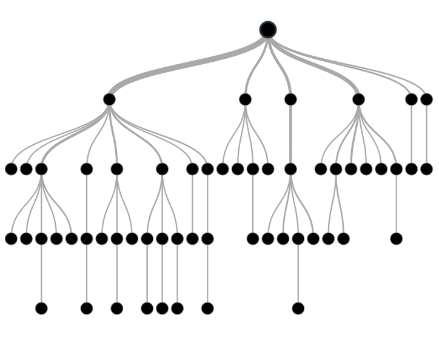

# A Beginner's Guide to Decision Trees

A decision tree is a series of nodes, a directional graph that starts at the base with a single node and extends to the many leaf nodes that represent the categories that the tree can classify. Another way to think of a decision tree is as a flow chart, where the flow starts at the root node and ends with a decision made at the leaves. It is a decision-support tool. It uses a tree-like graph to show the predictions that result from a series of feature-based splits. 

Here are some useful terms for describing a decision tree:

* Root Node: A root node is at the beginning of a tree. It represents entire population being analyzed. From the root node, the population is divided according to various features, and those sub-groups are split in turn at each decision node under the root node. 
* Splitting: It is a process of dividing a node into two or more sub-nodes.
* Decision Node: When a sub-node splits into further sub-nodes, it's a decision node.
* Leaf Node or Terminal Node: Nodes that do not split are called leaf or terminal nodes.
* Pruning: Removing the sub-nodes of a parent node is called pruning. A tree is grown through splitting and shrunk through pruning.  
* Branch or Sub-Tree: A sub-section of decision tree is called branch or a sub-tree, just as a portion of a graph is called a sub-graph.
* Parent Node and Child Node: These are relative terms. Any node that falls under another node is a child node or sub-node, and any node which precedes those child nodes is called a parent node. 

Decision trees are a popular algorithm for several reasons:

* Explanatory Power: The output of decision trees is interpretable. It can be understood by people without analytical or mathematical backgrounds. It does not require any statistical knowledge to interpret them. 
* Exploratory data analysis: Decision trees can enable analysts to identify significant variables and important relations between two or more variables, helping to surface the signal contained by many input variables. 
* Minimal data cleaning: Because decision trees are resilient to outliers and missing values, they require less data cleaning than some other algorithms. 
* Any data type: Decision trees can make classifications based on both numerical and categorical variables.
* Non-parametric: A decision tree is a non-parametric algorithm, as opposed to neural networks, which process input data transformed into a tensor, via tensor multiplication using large number of coefficients, known as parameters.

**Disadvantages**

* Overfitting: Over fitting is a common flaw of decision trees. Setting constraints on model parameters and making the model simpler through pruning are two ways to regularize a decision tree.
* Predicting continuous variables: While decision trees can ingest continuous numerical input, they are not a practical way to predict such values, since decision-tree predictions must be separated into discrete categories, which results in a loss of information when applying the model to continuous values.
* Heavy feature engineering: The flip side of a decision tree's explanatory power is that it requires heavy feature engineering. When dealing with unstructured data or data with latent factors, this makes decision trees sub-optimal. Neural networks are clearly superior in this regard. 

For a Java or Scala implementation, see the [Javadoc for decision trees](http://haifengl.github.io/smile/api/java/smile/classification/DecisionTree.html) from the [SMILE project](http://haifengl.github.io/smile/). 

### <a name="beginner">More Machine Learning Tutorials</a>

* [Introduction to Random Forests](./random-forest.html)
* [Introduction to Neural Networks](./neuralnet-overview)
* [Deep Reinforcement Learning](./deepreinforcementlearning)
* [Convolutional Networks (CNNs)](./convolutionalnetwork)
* [Generative Adversarial Networks (GANs)](./generative-adversarial-network)
* [LSTMs and Recurrent Networks](./lstm)
* [Word2Vec: Neural Embeddings for Natural Language Processing](./word2vec)
* [Combining Symbolic AI & Deep Learning](./symbolicreasoning)
* [Restricted Boltzmann Machines](./restrictedboltzmannmachine)
* [Eigenvectors, Covariance, PCA and Entropy](./eigenvector)
* [Neural Networks & Regression](./logistic-regression)
* [Open Datasets for Machine Learning](./opendata)
* [Inference: Machine Learning Model Server](./machine-learning-modelserver)
