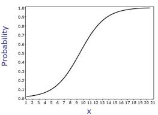

# A Beginner's Guide to Machine Learning Algorithms

## Algorithms Available on DL4J

While Deeplearning4j and its suite of open-source libraries - [ND4J](http://nd4j.org/), DataVec, Arbiter, etc. - primarily implement scalable, deep artificial neural networks, developers can also work with more traditional machine-learning algorithms using our framework.

* Linear Regression
* [Logistic Regression](./logistic-regression)
* [K-means clustering](https://deeplearning4j.org/doc/org/deeplearning4j/clustering/kmeans/package-tree.html )
* K nearest neighbor (k-NN)
* Optimizations of k-NN with a [VP-tree](https://en.wikipedia.org/wiki/Vantage-point_tree), [t-SNE](https://lvdmaaten.github.io/tsne/) and quad-trees as a side effect

## Algorithms Possible Using ND4J

ND4J is a generic tensor library, so the sky's the limit on what can be implemented. 

We are integrating with Haifeng Li's SMILE, or [Statistical Machine Intelligence and Learning Engine](http://haifengl.github.io/smile/), which implements more than one hundred different statistical and machine-learning algorithms, including random forests and GBMs. SMILE shows the best performance of any open-source JVM-based machine-learning library we've seen. 

# Popular Machine-Learning Algorithms

WIP.

## Linear Regression

Linear regression is a simple algorithm, and that makes it a great place to start thinking about algorithms in general. Here it is:

```
ŷ = a * x + b
```

Read aloud, we'd say "y-hat equals a times x plus b." 

* y-hat is the output, or guess made by the algorithm, the dependent variable.
* a is the coefficient. It's also the slope of the line that expresses the relationship between x and y-hat.
* x is the input, the given or independent variable.
* b is the intercept, where the line crosses the y axis.

Linear regression expresses a linear relationship between the input x and the output y; that is, for every change in x, y-hat will change by the same amount no matter how far along the line you are. The x is transformed by the same a and b at every point. 

Linear regression with only one input variable is called Simple Linear Regression. With more than one input variable, it is called Multiple Linear Regression. An example of Simple Linear Regression would be attempting to predict a house price based on the square footage of the house and nothing more. 

```
house price estimate = a * square footage + b
```
Multiple Linear Regression would take other variables into account, such as the distance between the house and a good public school, the age of the house, etc.  

The reason why we're dealing with y-hat, an estimate about the real value of y, is because linear regression is a formula used to estimate real values, and error is inevitable. Linear regression is often used to "fit" a scatter plot of given x-y pairs. A good fit minimizes the error between y-hat and the actual y; that is, choosing the right a and b will minimize the sume of the differences between each y and its respective y-hat.  

That scatter plot of data points may look like a baguette -- long in one direction and short in another -- in which case linear regression may achieve a fit. (If the data points look like a meandering river, a straight line is probably not the right function to use to make predictions.)


## Logistic Regression

Let's analyze the name first. Logistic regression is not really regression, not in the sense of linear regression, which predicts continuous numerical values. 

Logistic regression does not do that. It is actually a binomial classifier that acts like a light switch. A light switch essentially has two states, on and off. Logistic regression takes input data and classifies it as `category` or `not_category`, on or off expressed as 1 or 0, based on the strength of the input's signal. 

Logistic regression takes input data and *squishes* it, so that no matter what the range of the input is, it will be compressed into the space between 1 and 0. Notice, in the image below, no matter how large the input x becomes, the output y cannot exceed 1, which it asymptotically approaches, and no matter low x is, y cannot fall below 0. That's how logistic regression compresses input data into a range between 0 and 1, through this s-shaped, sigmoidal transform. 



## Decision Tree

A decision tree is a series of nodes, a directional graph that starts at the base with a single node and extends to the many leaf nodes that represent the categories that the tree can classify. Another way to think of a decision tree is as a flow chart, where the flow starts at the root node and ends with a decision made at the leaves. It is a decision-support tool. It uses a tree-like graph to show the predictions that result from a series of feature-based splits. 


Here are some useful terms for describing a decision tree:

* Root Node: A root node is at the beginning of a tree. It represents entire population being analyzed. From the root node, the population is divided according to various features, and those sub-groups are split in turn at each decision node under the root node. 
* Splitting: It is a process of dividing a node into two or more sub-nodes.
* Decision Node: When a sub-node splits into further sub-nodes, it's a decision node.
* Leaf Node or Terminal Node: Nodes that do not split are called leaf or terminal nodes.
* Pruning: Removing the sub-nodes of a parent node is called pruning. A tree is grown through splitting and shrunk through pruning.  
* Branch or Sub-Tree: A sub-section of decision tree is called branch or a sub-tree, just as a portion of a graph is called a sub-graph.
* Parent Node and Child Node: These are relative terms. Any node that falls under another node is a child node or sub-node, and any node which precedes those child nodes is called a parent node. 


Decision trees are a popular algorithm for several reasons:

* Explanatory Power: The output of decision trees is interpretable. It can be understood by people without analytical or mathematical backgrounds. It does not require any statistical knowledge to interpret them. 
* Exploratory data analysis: Decision trees can enable analysts to identify significant variables and important relations between two or more variables, helping to surface the signal contained by many input variables. 
* Minimal data cleaning: Because decision trees are resilient to outliers and missing values, they require less data cleaning than some other algorithms. 
* Any data type: Decision trees can make classifications based on both numerical and categorical variables.
* Non-parametric: A decision tree is a non-parametric algorithm, as opposed to neural networks, which process input data transformed into a tensor, via tensor multiplication using large number of coefficients, known as parameters.

**Disadvantages**

* Overfitting: Over fitting is a common flaw of decision trees. Setting constraints on model parameters and making the model simpler through pruning are two ways to regularize a decision tree.
* Predicting continuous variables: While decision trees can ingest continuous numerical input, they are not a practical way to predict such values, since decision-tree predictions must be separated into discrete categories, which results in a loss of information when applying the model to continuous values.
* Heavy feature engineering: The flip side of a decision tree's explanatory power is that it requires heavy feature engineering. When dealing with unstructured data or data with latent factors, this makes decision trees sub-optimal. Neural networks are clearly superior in this regard. 

## Random Forest

Random forests are made of many decision trees. They are ensembles of decision trees, each decision tree created by using a subset of the attributes used to classify a given population (they are sub-trees, see above). Those decision trees vote on how to classify a given instance of input data, and the random forest bootstraps those votes to choose the best prediction. This is done to prevent overfitting, a common flaw of decision trees. 

A random forest is a supervised classification algorithm. It creates a forest (many decision trees) and orders their nodes and splits randomly. The more trees in the forest, the better the results it can produce.


If you input a training dataset with targets and features into the decision tree, it will formulate some set of rules. These rules can be used to perform predictions. The author uses one example to illustrate this point: suppose you want to predict whether your daughter will like an animated movie, you should collect the past animated movies she likes, and take some features as the input. Then, through the decision tree algorithm, you can generate the rules. You can then input the features of this movie and see whether it will be liked by your daughter. The process of calculating these nodes and forming the rules is using information gain and Gini index calculations.

The difference between Random Forest algorithm and the decision tree algorithm is that in Random Forest, the process es of finding the root node and splitting the feature nodes will run randomly.

## Support-Vector Machine (SVM)

## Naive Bayes

## k-Nearest Neighbors (KNN)

## k-Means

## Dimensionality Reduction

## Gradient Boosting Algorithms

